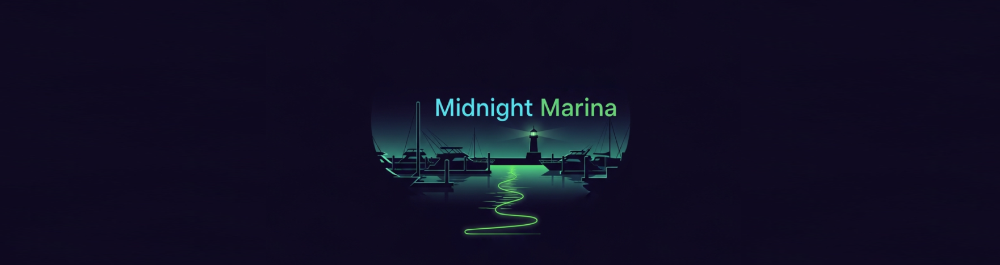
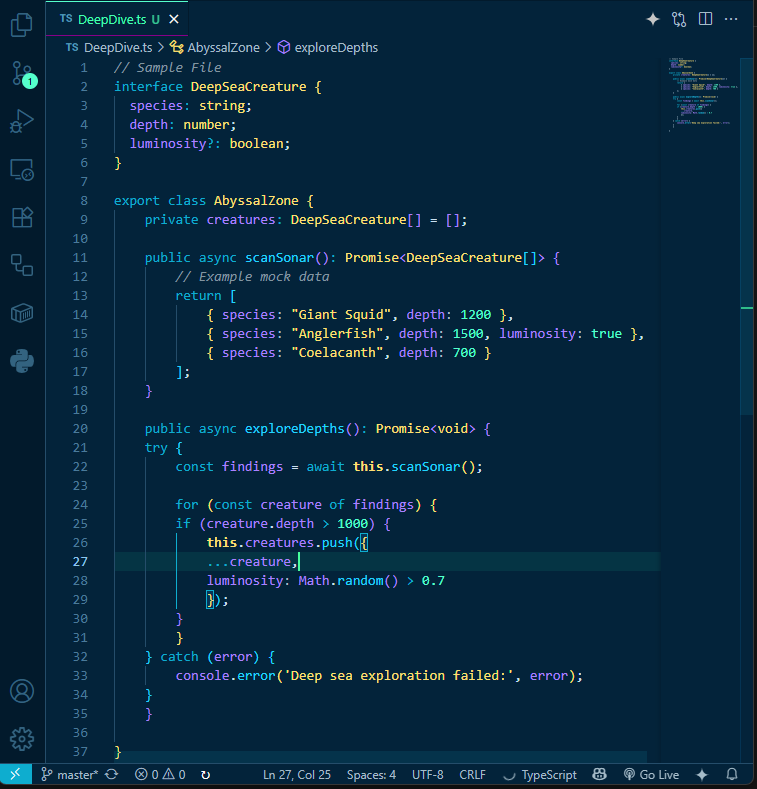
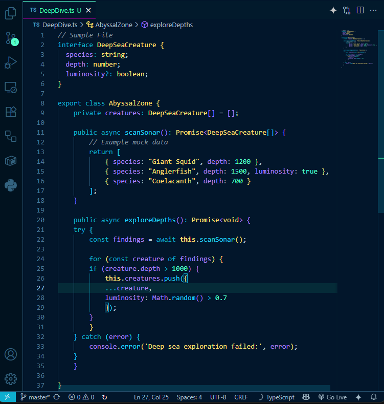

# Midnight Marina - VS Code Theme

Dive into the calm depths of the ocean with this theme.

Inspired by the endless depths of midnight seas, 
where bioluminescent creatures dance in the darkness and
the gentle glow of the marina lights reflects off calm waters.

### **Midnight Marina**: 
The classic version with balanced contrast

### **Midnight Marina Deep**: 
A deeper, more immersive variant for those who prefer darker backgrounds

This color scheme draws inspiration from the mystical beauty of deep ocean environments, aurora-lit waters, and the peaceful ambiance of midnight marinas.

We featur soothing teals, electric blues, and gentle aqua highlights which create a coding environment both calming and hopefully energizing at the  same time.

## Inspiration & Workflow

This theme was born from 6+ years of using the excellent [Synthwave '84 theme by robb0wen](https://github.com/robb0wen/synthwave-vscode)! A theme that I really love and guided me from nearly the beginning of my coding journey up to this date and to which I will always switch back when I need something more energetic.

I wanted to explore something new while maintaining that same attention of detail and atmospheric coding experience and I hope this theme does well or might do well in the future ahaha.

Ready to dive in? 🌊